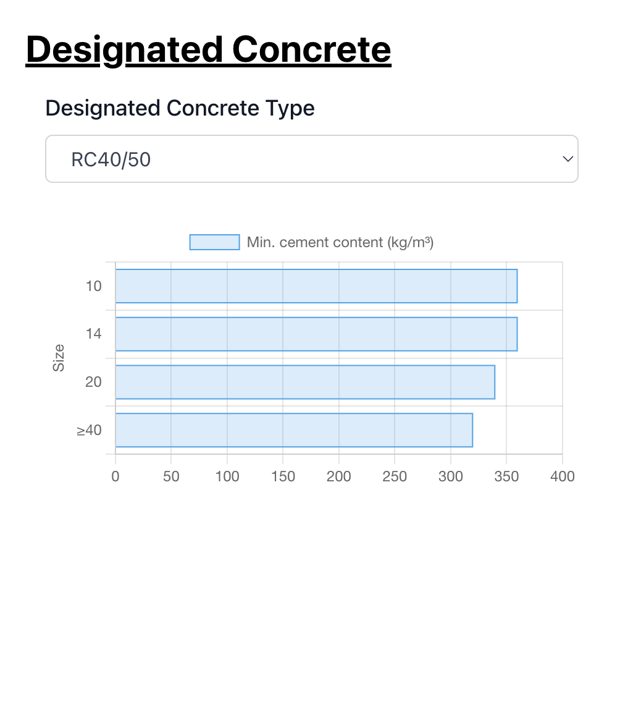

# Designated Concrete Application

This repository contains a React application for selecting and visualizing designated concrete types. The application allows users to select a concrete type from a list and view detailed information about the selected concrete in a bar chart.

You can try the live demo of the application at: https://concrete-mix.vercel.app/



## Features

(1) Concrete Type Selection: Users can choose a designated concrete type from a dropdown menu.
(2) Concrete Details Visualization: Display detailed information about the selected concrete type in a bar chart.
(3) Responsive Design: The application is fully responsive and adapts to different screen sizes.

## Getting Started

To get a local copy of the project up and running, follow these steps.

### Prerequisites

Ensure you have the following installed on your development machine:

Node.js (v12 or higher)
npm (v6 or higher) or yarn (v1.22 or higher)

### Installation

Clone the Repository

```
git clone https://github.com/yuansavage/concrete-mix.git
cd concrete-mix
```

Install Dependencies

```
npm install
or
yarn
```

### Run

Runs the app in development mode. Open http://localhost:3000 to view it in your browser.

```
npm start
or
yarn start
```

### Build

Builds the app for production to the build folder. It correctly bundles React in production mode and optimizes the build for the best performance.

```
npm run build
or
yarn build
```

### Running Tests

The application includes a set of unit tests to ensure the functionality of components and utilities. To run the tests, use:

```
npm test
or
yarn test
```

#### Test Coverage

The tests cover the following aspects (under _test_ folder):

(1) Component Rendering: Ensures that key components like App, ConcreteSelector, and ConcreteDetailsChart render correctly.
(2) Utilities: Verifies that helper functions, such as those that process data for lists or charts, work as expected.

## Technologies Used

```
React
Chart.js
React-Chartjs-2
MobX
TailwindCSS
Jest
React Testing Library
```
